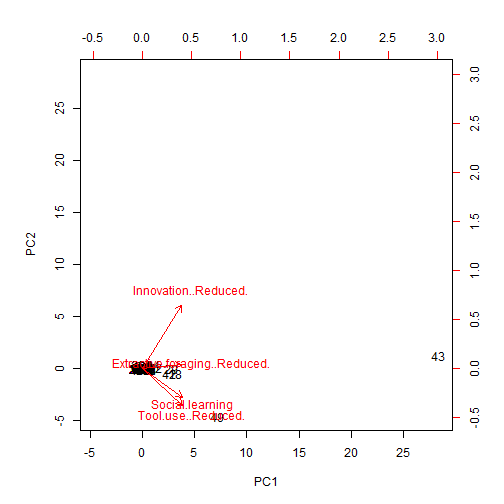
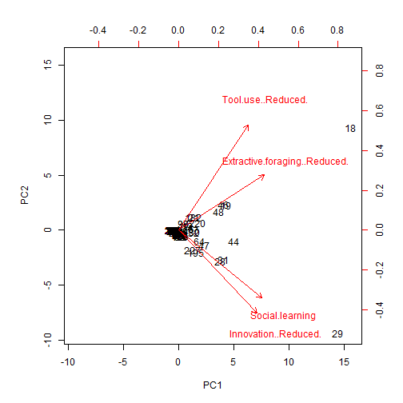
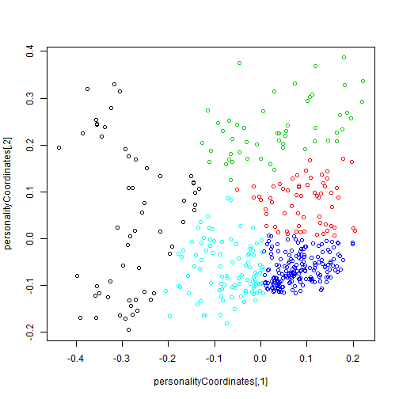
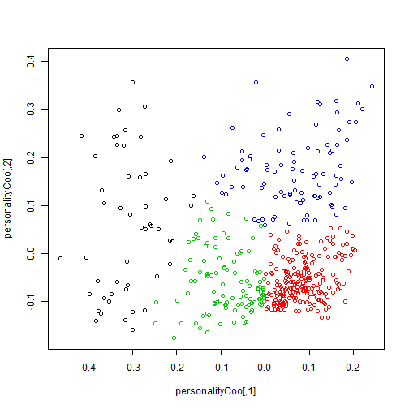
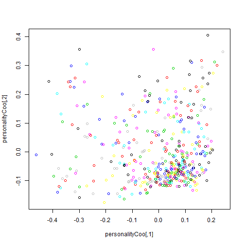
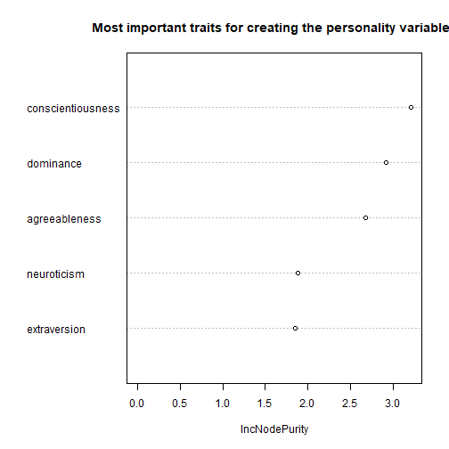
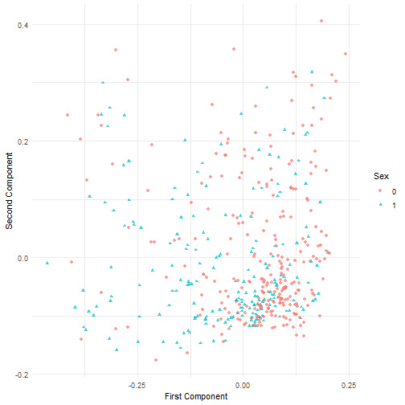
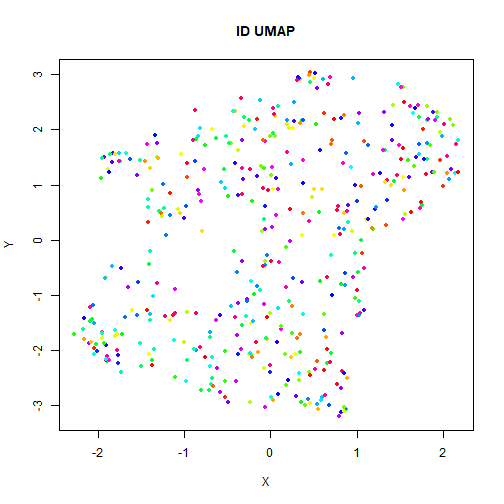
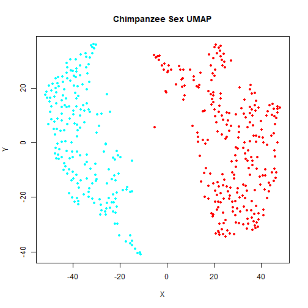

# Materials

First we need to get data. There's not many datasets available on primatology but I found some:

1. *The evolution of primate general and cultural intelligence*
Simon M. Reader , Yfke Hager  and Kevin N. Laland
Published:12 April 2011 https://doi.org/10.1098/rstb.2010.0342
**DOWNLOAD**: https://lalandlab.st-andrews.ac.uk/primate-dataset/

2. *Gombe chimpanzee personality*
Alexander Weiss
Last Updated: 2017-06-21 02:25 PM / DOI 10.17605/OSF.IO/S7D9D
**DOWNLOAD**: https://osf.io/s7d9d/

Nice, we have one about tool-use (multiple species) and one about behaviour (single chimpanzee population). Two very different problems.
 
# Objectives

Learn what is a dimensional reduction technique: when to use, general purpose, practical applications.
1. exploratory data analysis --> Visualization
2. feature extraction --> Data mining


```r
toolsRAW <- read.csv("./Data_ReaderHagerLalandPhilTrans2011.csv")
tools_data <- toolsRAW[,3:13]
str(tools_data) # Question 1: How many possible ways to "visualize" the numerical variables
```

```
## 'data.frame':	238 obs. of  11 variables:
##  $ SpeciesPurvis                : Factor w/ 238 levels "Allenopithecus nigroviridis",..: 22 23 24 25 26 46 47 48 49 50 ...
##  $ GenusPurvis                  : Factor w/ 58 levels "Allenopithecus",..: 6 6 6 6 6 11 12 12 12 12 ...
##  $ Taxon                        : Factor w/ 3 levels "Prosimian","Simian",..: 2 2 2 2 2 2 2 2 2 2 ...
##  $ Great.ape                    : Factor w/ 2 levels "Great ape","No": 2 2 2 2 2 2 2 2 2 2 ...
##  $ Innovation                   : int  0 0 0 0 0 1 0 0 0 0 ...
##  $ Tool.use                     : int  0 0 0 0 0 0 0 0 0 0 ...
##  $ Extractive.foraging          : int  0 0 0 0 0 1 0 0 0 0 ...
##  $ Social.learning              : int  0 0 0 2 0 0 0 0 0 0 ...
##  $ Innovation..Reduced.         : int  0 0 0 0 0 0 0 0 0 0 ...
##  $ Tool.use..Reduced.           : int  0 0 0 0 0 0 0 0 0 0 ...
##  $ Extractive.foraging..Reduced.: int  0 0 0 0 0 0 0 0 0 0 ...
```

```r
toolsPC <- prcomp(tools_data[,8:11], scale. = TRUE)
biplot(toolsPC, scale = 0) # Question 2: What is the observation 43?
```



```r
# What about 49 and 42?
```

Great apes are just too different.


```r
no_ga <- tools_data[tools_data$Great.ape == "No",] # remove great apes
no_gaPC <- prcomp(no_ga[,8:11], scale. = TRUE)
biplot(no_gaPC, scale = 0) # So we have 2 new outlier!
```



```r
# Question 3: What species are 18... and 29? Notice the directions of loading.
```


```r
library(uwot)
```

```
## Loading required package: Matrix
```

```r
pCoo <- umap(tools_data[,8:11], verbose = TRUE, spread = 20)
```

```
## 23:45:19 Read 238 rows and found 4 numeric columns
```

```
## 23:45:19 Using FNN for neighbor search, n_neighbors = 15
```

```
## 23:45:19 Commencing smooth kNN distance calibration using 2 threads
```

```
## 23:45:20 Initializing from normalized Laplacian + noise
```

```
## 23:45:20 Commencing optimization for 500 epochs, with 6024 positive edges
```

```
## 23:45:22 Optimization finished
```

```r
vizier::embed_plotly(pCoo, as.factor(tools_data$Tool.use > 0), title = "ID UMAP")
```

```
## PhantomJS not found. You can install it with webshot::install_phantomjs(). If it is installed, please make sure the phantomjs executable can be found via the PATH variable.
```

```
## Warning in normalizePath(path.expand(path), winslash, mustWork):
## path[1]="webshot89b03d367bef.png": The system cannot find the file
## specified
```

```
## Warning in file(con, "rb"): cannot open file 'C:
## \Users\delvi\AppData\Local\Temp\RtmpwbZEwt\file89b029337f4c\webshot89b03d367bef.png':
## No such file or directory
```

```
## Error in file(con, "rb"): cannot open the connection
```

TEST


```r
##### load data

chimpRaw <- read.csv("gombe_460.csv")

chimpPerson <- chimpRaw[,c(19:42)] # only getting the raw personality traits to built the unsupervised model

# Working example for Alex

library(randomForest) # implementation of the RF algorithm
```

```
## randomForest 4.6-14
```

```
## Type rfNews() to see new features/changes/bug fixes.
```

```r
library(ggplot2) # library for graphics
```

```
## 
## Attaching package: 'ggplot2'
```

```
## The following object is masked from 'package:randomForest':
## 
##     margin
```

```r
library(magrittr) # pipes

### NA REMOVAL

set.seed(080)
pre_rf <- randomForest(chimpPerson %>% na.roughfix, proximity = TRUE)
personalityCoordinates <- (1 - pre_rf$proximity) %>% cmdscale()
cl <- kmeans(personalityCoordinates, 5) # I arbitrarly picked 5, look at your plot to decide>
plot(personalityCoordinates, col = cl$cluster)
```



```r
new_x <- rfImpute(chimpPerson, cl$cluster %>% factor)[,-1] # removes any NA in your dataset, quite robust method
```

```
## ntree      OOB      1      2      3      4      5
##   300:  21.96% 33.33% 62.90% 23.08%  5.88% 19.61%
## ntree      OOB      1      2      3      4      5
##   300:  23.04% 31.58% 64.52% 21.15%  7.49% 22.55%
## ntree      OOB      1      2      3      4      5
##   300:  23.04% 33.33% 64.52% 23.08%  5.88% 23.53%
## ntree      OOB      1      2      3      4      5
##   300:  23.04% 29.82% 72.58% 21.15%  6.95% 19.61%
## ntree      OOB      1      2      3      4      5
##   300:  22.61% 31.58% 64.52% 21.15%  7.49% 20.59%
```

```r
# UNSUPERVISED RANDOM FOREST

# now that we have created alias for the missing values, let's recreate the random forest
set.seed(080)
rf <- randomForest(new_x, proximity = TRUE)
personalityCoo <- (1 - rf$proximity) %>% cmdscale()

# calculate the clusters using k-means.

cl <- kmeans(personalityCoo, 4)
plot(personalityCoo, col = cl$cluster)
```



```r
plot(personalityCoo, col = chimpRaw$chimpcode) # doesn't really seem discriminative, but this dataset has 128 indivudals, but only 460 observations!!! lol.
```



```r
# Importance of variable (you can test this with any other variables).

new_df <- cbind(chimpRaw, data.frame(personalityCoo))
# X1 and X2 are the two components of the model generated just above, they work as coordinates for plotting personality
indModel <- randomForest(X1 + X2 ~ dominance + extraversion + conscientiousness + agreeableness + neuroticism, data = new_df) # these are the variables I removed in the beginning, so to see if X1 and X2 are really about personality 
varImpPlot(indModel, main = "Most important traits for creating the personality variables")
```



```r
# Pretty plot looking at sex differences, most males are towards the left axis, while most females are in the right quadrants
# Still there is a lot of overlap. But again, this dataset is not really optimal.

ggplot(data = new_df, aes(x = X1, y = X2)) +
  geom_point(aes(color = as.factor(new_df$sex), shape = as.factor(new_df$sex)), alpha = 0.7) +
  labs(x = "First Component", y = "Second Component", color = "Sex", shape = "Sex") +
  guides(color = guide_legend(), shape = guide_legend()) + theme_minimal()
```



```r
# I'd say it's impossible to detect individuals based on personality traits observed 
# at least with this dataset and observation protocol. Still let's have a look

plot(personalityCoo, col = new_df$chimpcode)
```


```r
# Yep. It's a mess. But with a dataset with far less individuals, and more observations, it might be possible.

# Hugs, J


library(uwot)
pCoo <- umap(new_x, scale = TRUE, verbose = TRUE, y = new_df$chimpcode)
```

```
## 23:45:28 Read 460 rows and found 24 numeric columns
```

```
## 23:45:28 Scaling to zero mean and unit variance
```

```
## 23:45:28 Kept 24 non-zero-variance columns
```

```
## 23:45:28 Using FNN for neighbor search, n_neighbors = 15
```

```
## 23:45:28 Commencing smooth kNN distance calibration using 2 threads
```

```
## 23:45:29 Processing y data
```

```
## 23:45:29 Carrying out categorical intersection for 1 column
```

```
## 23:45:29 Applying categorical set intersection, weight = 0.5 far distance = 5
```

```
## 23:45:29 Initializing from normalized Laplacian + noise
```

```
## 23:45:29 Commencing optimization for 500 epochs, with 10374 positive edges
```

```
## 23:45:30 Optimization finished
```

```r
vizier::embed_plot(pCoo, as.factor(new_df$chimpcode), title = "ID UMAP")
```



```r
set.seed(1992)
pCooS <- umap(new_x, scale = TRUE, verbose = TRUE, y = as.factor(new_df$sex), spread = 16)
```

```
## 23:45:30 Read 460 rows and found 24 numeric columns
```

```
## 23:45:30 Scaling to zero mean and unit variance
```

```
## 23:45:30 Kept 24 non-zero-variance columns
```

```
## 23:45:30 Using FNN for neighbor search, n_neighbors = 15
```

```
## 23:45:31 Commencing smooth kNN distance calibration using 2 threads
```

```
## 23:45:31 Processing y data
```

```
## 23:45:31 Carrying out categorical intersection for 1 column
```

```
## 23:45:31 Applying categorical set intersection, weight = 0.5 far distance = 5
```

```
## 23:45:31 Initializing from normalized Laplacian + noise
```

```
## 23:45:31 Commencing optimization for 500 epochs, with 9286 positive edges
```

```
## 23:45:32 Optimization finished
```

```r
vizier::embed_plot(pCooS, as.factor(new_df$sex), title = "Chimpanzee Sex UMAP")
```



