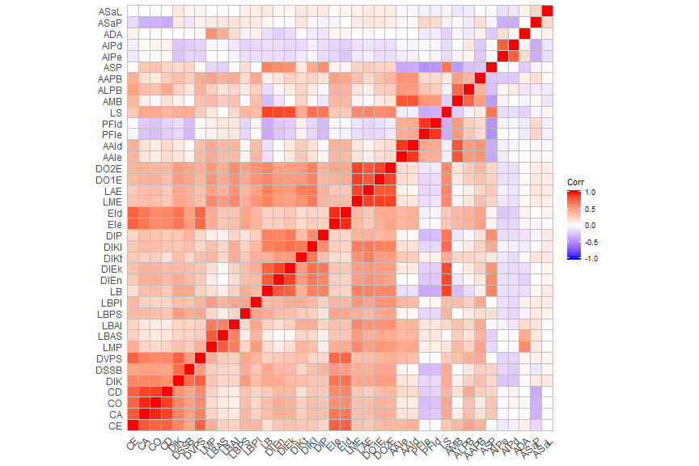
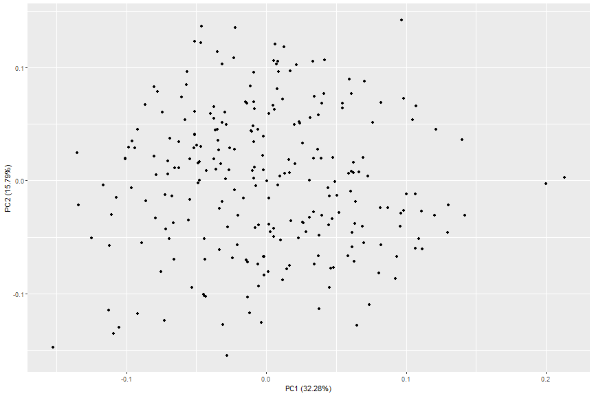
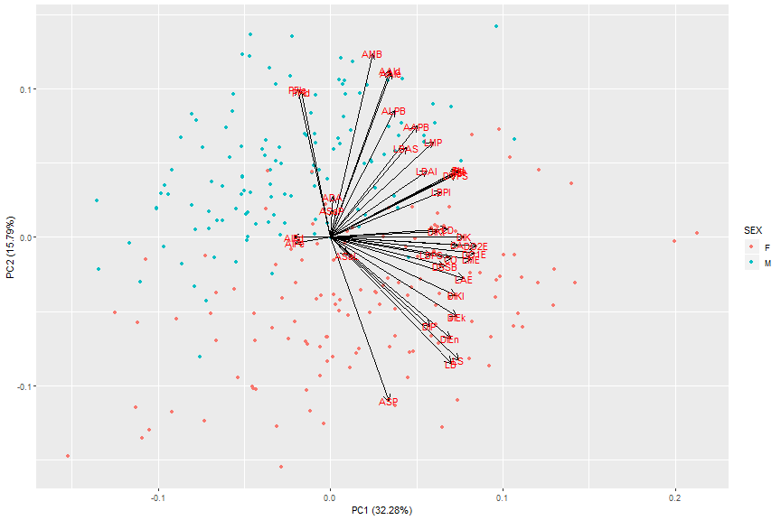
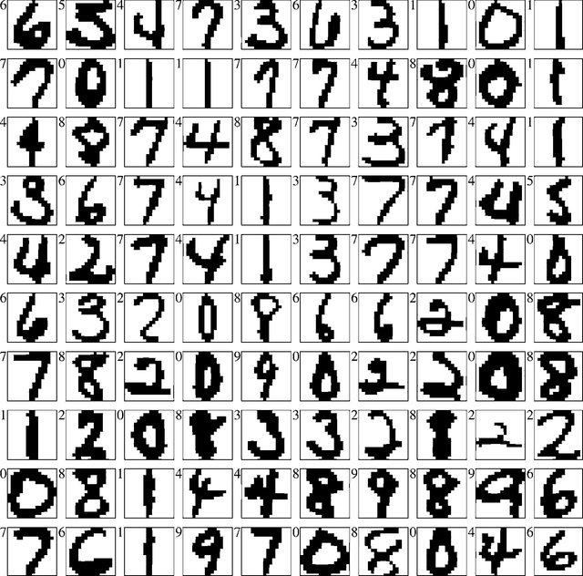

## Dimensionality - quick intro


In a "tidy" dataset each column is a variable and each row contains observations

> + **Dimension**: Any feature (i.e. variable) in a dataset
> + **Dimensionality**: Number of features in a dataset.


```r
cad <- readRDS("./cadoes.rds") # dataset with measurements from pelvic bones
dim(cad)
```

```
## [1] 251  40
```

```r
names(cad) # your can use scr() or summary() to have a better look at the data
```

```
##  [1] "ID"   "SEX"  "CE"   "CA"   "CO"   "CD"   "DIK"  "DSSB" "DVPS" "LMP" 
## [11] "LBAS" "LBAI" "LBPS" "LBPI" "LB"   "DIEn" "DIEk" "DIKt" "DIKI" "DIP" 
## [21] "EIe"  "EId"  "LME"  "LAE"  "DO1E" "DO2E" "AAIe" "AAId" "PFIe" "PFId"
## [31] "LS"   "AMB"  "ALPB" "AAPB" "ASP"  "AIPe" "AIPd" "ADA"  "ASaP" "ASaL"
```

```r
cadoes <- na.omit(cad[ , -c(1:2)]) # only the numbers (hip measurements)
```


--- .class #id 

## Curse of dimensionality

> + As data dimensionality **grows** → the feature space **grows faster**

Why do we care?

> 1. Sparse feature space
> 2. Bigger computational costs
> 3. Model accuracy decreases
> 4. Difficult to interpret data in high-dimensional spaces

Think again about our CADOES dataset - **osteomics.com/CADOES**


```r
cadPC <- prcomp(cadoes, center = TRUE, scale. = TRUE)
```

In R we can use `prcomp()` or `princomp()` functions, for performing a principal components analysis on the given data matrix.

There are many other options as well in packages, like **FactoMineR**

---

## Principal Component Analysis (PCA)

#### Advantages

> + Removes noise introduced by correlation
> + Changes the coordinate system
> + Establishes new features (i.e. "components")
> + Reduces the dimensionality of the data

#### The algorithm in 5 steps

> 1. mean normalization
> 2. feature scaling (optional)
> 3. Rotation (principal components as axis)
> 4. Projection
> 5. Reduce *n*-dimension to *k* (retain x% of variance)

--- .class #id

## Curse of dimensionality: Collinearity


```r
library(ggcorrplot)
ggcorrplot(cor(cadoes))
```



> + Are all those variables equally important to understand the dataset?
> + Are there **latent dimensions** that could represent the dataset using less dimensions?

--- 

## Dimensionality reduction

> + **Observed features** can obscure the **hidden** *instrinsic* dimensionality of a dataset (which can be much smaller).


```r
library(ggfortify) # allows ggplot2 to understand prcomp() objects.
autoplot(cadPC)
```



--- 

## Dimensionality reduction


```r
autoplot(cadPC, data = cad, colour = "SEX", loadings = TRUE,
         loadings.colour = "black", loadings.label = TRUE)
```



#### Solving the Curse of Dimensionality

> 1. Feature engineering (requires domain knowledge)
> 2. Dimensionality reduction algorithms (to remove redundancy)

---

## Dimensionality reduction algorithms

#### Matrix factorization
+ Principal Component Analysis;
+ Linear Autoencoder;
+ Latent Dirichlet Allocation;
+ Non-negative Matrix Factorization;
+ Generalised Low Rank Models;
+ Word2Vec;
+ GloVe

#### Neighbour graphs
+ Laplacian Eigenmaps;
+ Hessian Eigenmaps;
+ Local Tangent Space Alignment;
+ JSE,
+ Isomap;
+ Locally Linear Embedding;
+ **t-SNE**; (state-of-the art since 2008)
+ **UMAP** (new kid on the block)

---

## Let's play!



Open `computer_vision.R`
